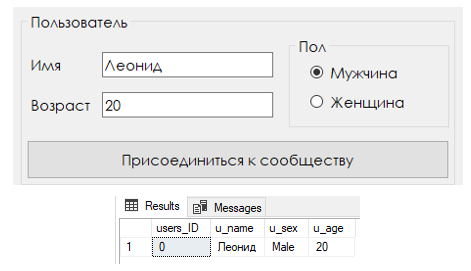

# Разработка приложения, взаимодействующего с базой данных

## Введение
Было разработано классическое CRUD приложение «Вегетарианское сообщество» с использованием Windows Forms. Приложение представляет собой окно с обсуждениями на разные темы, в котором пользователи могут оставлять комментарии. 

В качестве СУБД использовалась MS SQL Server. Вся информация хранится на локальном сервере в базе данных.

Для работы с базой данных использовался пакет Microsoft.Data.SqlClient.

## Создание базы данных
Создадим базу данных на основе данной ER-модели.

Создадим саму базу данных.

Создадим таблицы пользователей, постов и комментариев.

## Интеграция базы данных с приложением
Для работы с базой данных MS SQL Server необходимо установить в проект через nuget пакет Microsoft.Data.SqlClient.

Создадим файл конфигурации с базой данных.

Теперь можно подключиться к базе данных и выполнять SQL запросы.

## Пример работы программы
В приложении есть возможность добавления пользователя в сообщество, создание обсуждения и добавления комментария к обсуждению. В приложении можно редактировать и удалять комментарии по выбранным элементам listBox. Также есть возможность просмотра всех комментариев под разными обсуждениями.

На рисунке ниже представлен главное окно приложения. 

Добавим нового пользователя в сообщество.

Создадим новое обсуждение.

Теперь добавим еще новых пользователей и попробуем провести обсуждение по заданному вопросу.

Добавим комментарий.

Полученное окно "Обсуждение".

Можно редактировать сообщения, выбрав их в окне "Обсуждение" и введя новый текст. Изменим благодарственное последнее сообщение.

Также есть возможность удаления комментариев, нужно выбрать комментарий в окне «Обсуждение» и нажать кнопку «Удалить комментарий».

Удалим все комментарии человека, который любит мясо (пользователь под номером 5).

Зададим новый вопрос и опять проведем обсуждение.

В итоге у нас есть два обсуждения, которые можно переключать и видеть все комментарии по определенному вопросу.

## Завершение
Было разработано классическое CRUD-приложение. Данное приложение предусматривает функции добавления, редактирования, удаления, показа и хранения объектов в базе данных.

База данных расположена на локальном сервере. Для работы с базой данных использовалась СУБД Microsoft SQL Server. База данных была интегрирована в Microsoft Windows Forms.
